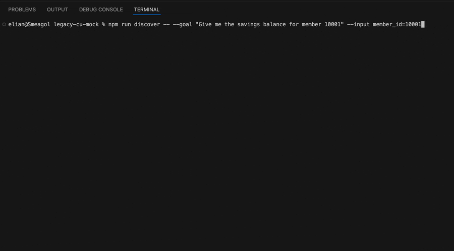
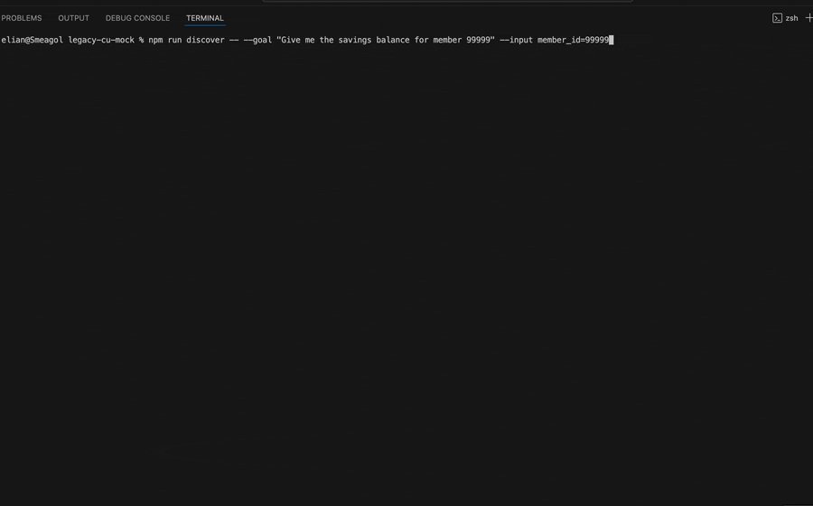

# Legacy Credit Union Back-Office (mock)

A deliberately legacy-styled, server-rendered Flask app used as a target
surface for browser automation testing. Table-based layout, minimal CSS,
no client-side JS, no JSON/API endpoints. Every interaction is a form POST
or a full-page link navigation.

## Demo
- Searching for the Savings Balance of member 10001:


- Searching for a member that does not exist (human escalation):


## Running it

```bash
python3 -m venv .venv
source .venv/bin/activate
pip install -r requirements.txt
```

Run one tenant:

```bash
TENANT=first_credit_union PORT=5001 python3 app.py
```

Run both tenants simultaneously (separate terminals or background):

```bash
TENANT=first_credit_union PORT=5001 python3 app.py &
TENANT=riverbend         PORT=5002 python3 app.py &
```

Then visit `http://127.0.0.1:5001` and `http://127.0.0.1:5002`.

### Config

| Env var         | Default                  | Purpose                          |
|-----------------|---------------------------|-----------------------------------|
| `TENANT`        | `first_credit_union`     | `first_credit_union` or `riverbend` |
| `PORT`          | `5000`                   | Port to bind                     |
| `OPERATOR_USER` | `operator`                | Login username                   |
| `OPERATOR_PASS` | `changeme123`             | Login password                   |
| `SECRET_KEY`    | `dev-secret-key-change-me`| Flask session signing key        |

Log in at `/login` with the operator credentials above, then use the
"Member ID" (or "Account Number", for `riverbend`) field on `/search`.

## Tenant differences

| Tenant                | Header                              | Search field label | Search button | Extra nav item |
|------------------------|--------------------------------------|---------------------|----------------|------------------|
| `first_credit_union` (default) | First Credit Union — Back Office | Member ID           | Search         | (none)           |
| `riverbend`            | Riverbend Financial — Teller Console | Account Number      | Find           | Reports          |

## Seeded member IDs

| Member ID | Behavior |
|-----------|----------|
| `10001`   | Normal member, full account table (Savings, Checking, Share Certificate) |
| `10002`   | Renders "You do not have permission to view this member" |
| `10003`   | Detail page sleeps 8 seconds before responding, then renders a normal account table |
| `10004`   | Returns HTTP 500 with an error page |
| `99999`   | Renders "No member found" on the search results screen |
| any other | "No member found" |

## Query flags (usable on any authenticated page)

| Flag              | Effect |
|--------------------|--------|
| `?expire=1`        | Clears the session and redirects to `/login` with "Session expired" |
| `?interstitial=1`  | Renders a "Scheduled System Maintenance" block with a "Continue" button before the real page content |

## Pages

- `/login` — operator login form
- `/search` — Member ID/Account Number field + Search/Find button
- `/member/<id>` — detail screen; embeds `/member/<id>/panel` in an `<iframe>`
- `/member/<id>/panel` — the account table (Type | Account No | Balance), rendered standalone for the iframe
- `/member/<id>/close` (POST) → confirmation screen → `/member/<id>/close/confirm` (POST)
- `/member/<id>/subaccount/new` — multi-field form
- `/member/<id>/subaccount/confirm` — confirmation screen, then finalizes on POST

## Accessibility tree notes (intentionally mixed)

- The Member ID / Account Number input has a proper `<label for="f_mbr_id">`.
- The Search/Find button is a real `<input type="submit">`.
- The search page also has an unlabeled `<input name="txtSearch">` and a
  `<div onclick="...">Advanced</div>` styled as a button — neither is
  reachable by label/role+name.
- The Savings balance on the member panel has no label or id; it's only
  findable by its position in the table row containing the text "Savings".
- Error/not-found messages are wrapped in `<div class="msg_err">` so
  automation can scope detection instead of pattern-matching the full page.
